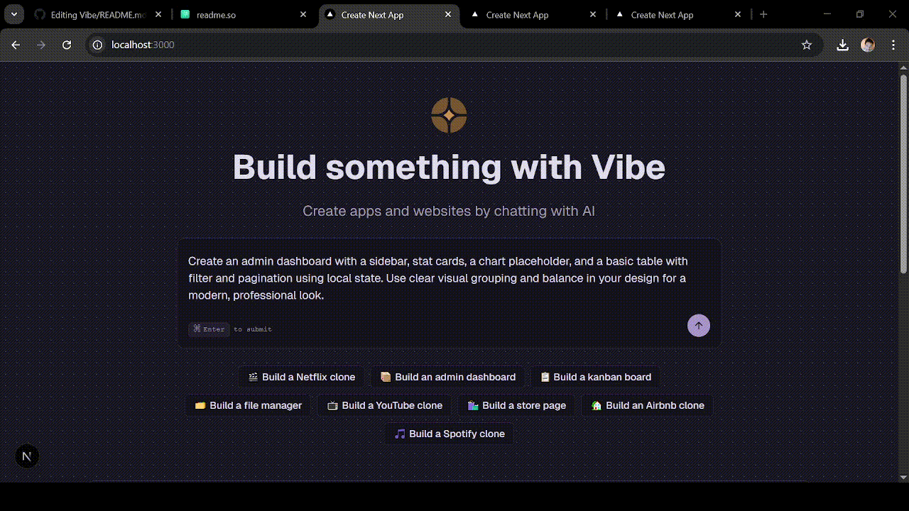

# AI-Powered Full-Stack App Generator

A Next.js 15 full-stack application that generates complete web applications from **natural language prompts** using AI agents powered by **OpenAI LLMs**. Users can explore all generated project files in a sandboxed environment.


## Demo




## Features

- Converts **natural language prompts** into live Next.js projects.
- **Sandboxed template execution system** that allows AI to autonomously add files safely.
- Full access to all **AI-generated project files and code previews**.
- Implements **project dashboards and theme customization** for easy exploration.

## Tech Stack
- **Frontend & Backend:** Next.js 15, React 19, Tailwind v4  
- **Full-Stack Communication:** tRPC  
- **Background Jobs & AI Agents:** Inngest, OpenAI LLM  
- **Sandboxing & Templates:** Docker  


## Getting Started

Clone the repository:  

```bash
  git clone git@github.com:OmJha5/Vibe.git
```
Install dependencies:  

```bash
  npm install
```

Create a .env file in the project root and add below:  

```bash
  DATABASE_URL=your_postgresql_url
  OPENAI_API_KEY=your_openai_key
  NEXT_PUBLIC_SOURCE_APP=http://localhost:3000
  NODE_ENV=development
  E2B_API_KEY=your_e2b_key
```

Create the e2b sandbox template which will be used by AI Agent to make full stack NextJs site.

```bash
  e2b template build --name {your unique sandbox template name} --cmd "/compile_page.sh" --dockerfile ./sandbox-templates/nextjs/e2b.Dockerfile
```

Start the development server and inngest development server:  

```bash
  npm run dev
  npx inngest-cli@1.8.0 dev
```


    
## Other Instruction

Make sure Docker is installed in your PC which will be used while creating sandbox template and if you find any problem you can reach out to me at omjha003@gmail.com

